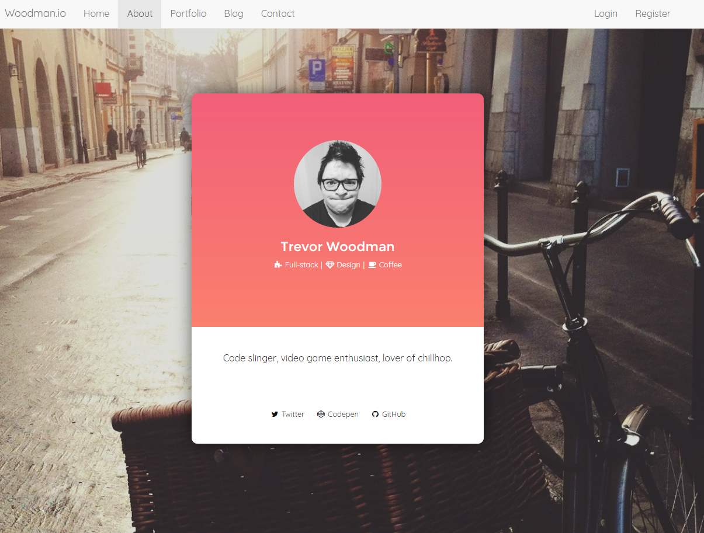

## Website and blog repo for woodman.io

This project was finished in about a week.

I used Laravel 5 (PHP),Blade Templating, JavaScript, and Sass to create a website where I could log in, post to my blog, edit blog posts, add blog header images, see a list of my posts, etc. The post editor used a customized TinyMCE plugin.

I implemented tags at one point but felt they were too clunky, so I removed them.

This was the front page:

